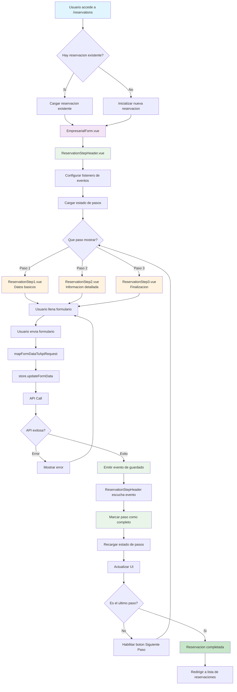
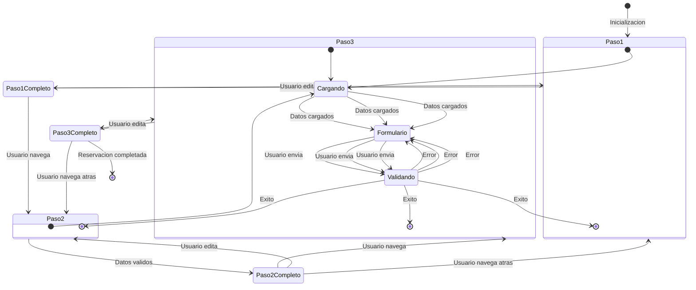
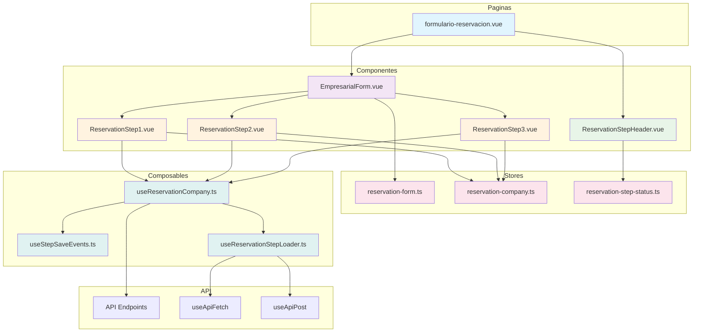
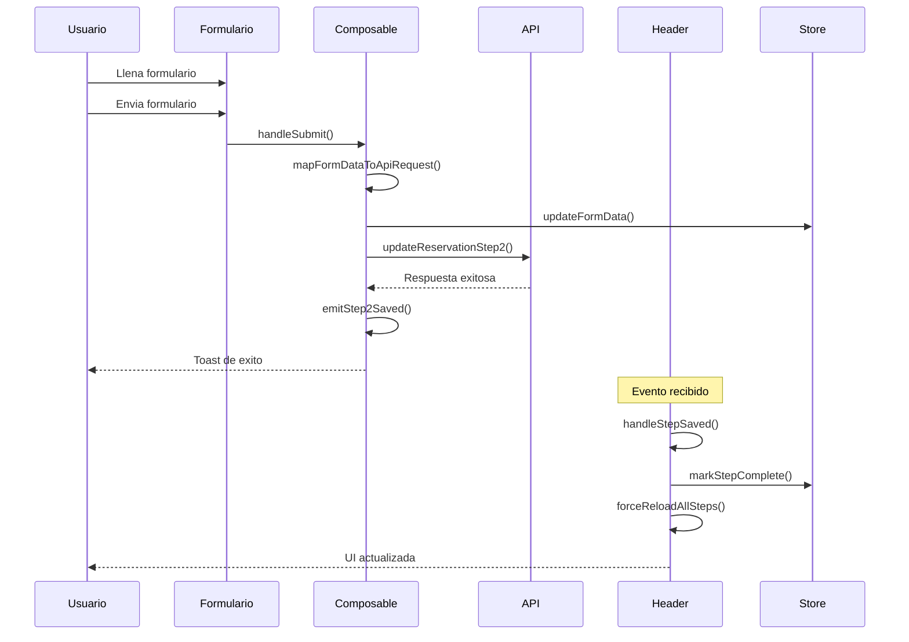
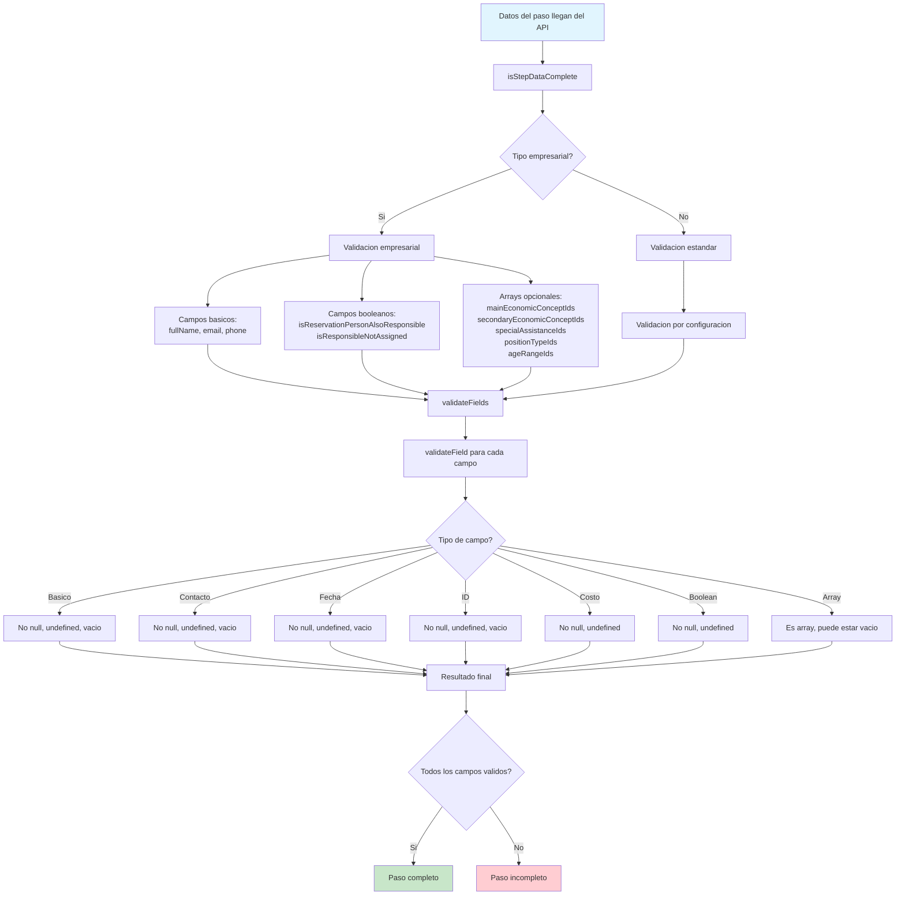
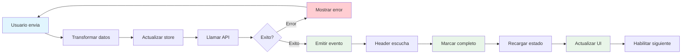
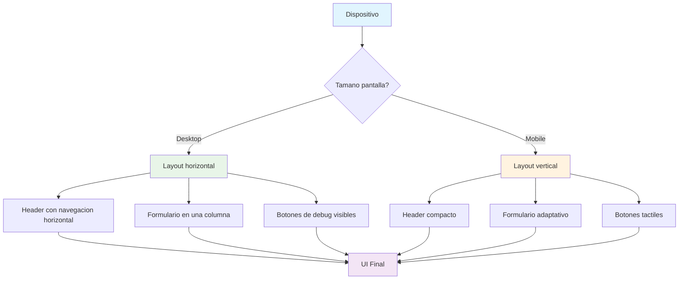

# Diagrama de Flujo - Reservación Empresarial

## Diagrama Principal

## Diagrama de Estados de Pasos

## Diagrama de Componentes

## Diagrama de Eventos

## Diagrama de Validacion

## Diagrama de Flujo de Guardado

## Diagrama de Responsive

---

## Como Visualizar los Diagramas

### Opciones para ver los diagramas:

1. **GitHub**: Los diagramas Mermaid se renderizan automaticamente
2. **VS Code**: Instala la extension "Mermaid Preview"
3. **Online**: Usa [mermaid.live](https://mermaid.live)
4. **Documentacion**: Copia el codigo Mermaid en cualquier editor compatible

### Para editar los diagramas:

1. Modifica el codigo Mermaid en este archivo
2. Los diagramas se actualizaran automaticamente
3. Puedes agregar nuevos diagramas siguiendo la sintaxis Mermaid

---

Estos diagramas muestran visualmente todo el flujo de una reservacion empresarial, desde la inicializacion hasta la finalizacion, incluyendo la arquitectura de componentes, eventos, validacion y estados.
